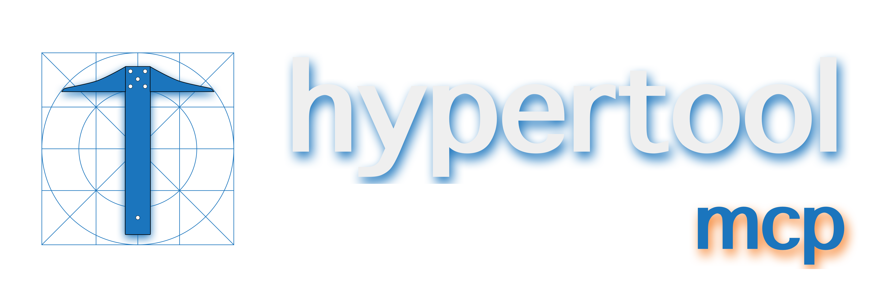
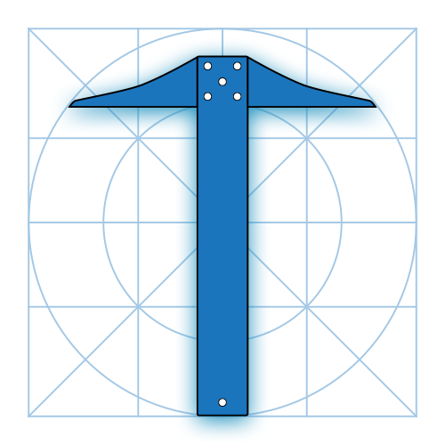

<picture>
  <source media="(prefers-color-scheme: dark)" srcset="./assets/hypertool_darkmode_wordmark_horizontal.png">
  <source media="(prefers-color-scheme: light)" srcset="./assets/hypertool_lightmode_wordmark_horizontal.png">
  
</picture>

<h1 align="center">Give your AI the best tools from all your MCPs 🎯</h1>


[](https://npmjs.com/package/@toolprint/hypertool-mcp)
[](https://npmjs.com/package/@toolprint/hypertool-mcp)
[](https://www.typescriptlang.org/)
[](https://modelcontextprotocol.io)
[](LICENSE)


## ⚡ Features

### 🔓 **Break Free from Tool Limits**
Connect unlimited MCP servers. Use 10, 50, or 500+ tools total - your AI only sees what it needs.

### 🎯 **Task-Specific Toolsets** 
Build "git-essentials" with 5 tools instead of drowning in 47 Git commands. Switch contexts instantly.

### 🧠 **Smart Tool Descriptions**
Enhance tools with examples and context. Watch your AI pick the right tool 89% more often.

## 🚀 Quick Start

### Step 1: Copy Your Existing Config
```bash
# In your project directory
cp .mcp.json .mcp.hypertool.json
```

### Step 2: Point Your AI to HyperTool
Replace your `.mcp.json` with:
```json
{
  "mcpServers": {
    "hypertool": {
      "command": "npx",
      "args": ["-y", "@toolprint/hypertool-mcp@latest", "--mcp-config", ".mcp.hypertool.json"]
    }
  }
}
```

### Step 3: Create Your First Toolset
Restart your AI and try:
```
You: "Create a toolset called 'coding' with git and docker tools"
AI: "Created 'coding' toolset with 15 focused tools"

You: "Switch to coding toolset"
AI: "Equipped! I now have just the tools needed for development"
```

**That's it!** Your AI is now focused and effective. 🎉

💡 **Want automated setup?** Try our interactive `setup` command - see [Advanced Guide](guides/ADVANCED.md#setup-command) for details.

## 🎬 Demo

### Hotswap toolsets across 100+ tools

<div align="center">
  <a href="https://www.youtube.com/watch?v=43fkKOBayCg">
    
  </a>
</div>

## 🏗️ How It Works

```
Before: Tool Chaos 😵
┌─────────────┐   ┌─────────────────────────────┐
│ Claude/     │──▶│ 50+ tools from 8 servers   │
│ Cursor      │   │ ❌ Wrong picks             │
│             │   │ ❌ Slow decisions          │
│             │   │ ❌ Confused context        │
└─────────────┘   └─────────────────────────────┘

After: Expert Mode 🎯
┌─────────────┐   ┌──────────────┐   ┌─────────────────┐
│ Claude/     │──▶│ HyperTool    │──▶│ ALL Your Tools  │
│ Cursor      │   │ (Local)      │   │ (Same servers)  │
└─────────────┘   └──────────────┘   └─────────────────┘
                         │
                         ▼
                  ┌─────────────────┐
                  │ Smart Toolsets  │
                  │ 🔨 coding (5)   │ ← "I'm coding now"
                  │ 📝 writing (3)  │ ← "I'm writing now"
                  │ 📊 analysis (4) │ ← "I'm analyzing now"
                  └─────────────────┘
                  ✅ Expert picks every time
```

### What's a "Toolset"? Think Playlists for Your AI

Just like Spotify playlists organize your music, toolsets organize your AI tools:

```
ALL YOUR TOOLS (64 total)              YOUR TOOLSETS
┌────────────────────────────┐         ┌──────────────────┐
│ 🐳 Docker (19 tools)       │         │ 🔨 "coding"      │
│  • build_image             │   ┌───▶ │  • git.status    │
│  • create_container        │   │     │  • git.commit    │
│  • run_container           │   │     │  • docker.build  │
│  • stop_container          │   │     │  • docker.run    │
│  • [... 15 more]           │   │     │  • github.pr     │
├────────────────────────────┤   │     └──────────────────┘
│ 🔀 Git (12 tools)          │───┤
│  • status                  │   │     ┌──────────────────┐
│  • commit                  │   │     │ 📝 "writing"     │
│  • push                    │   └───▶ │  • notion.create │
│  • [... 9 more]            │         │  • slack.send    │
├────────────────────────────┤         │  • grammarly.fix │
│ 📝 Notion (8 tools)        │─────┐   └──────────────────┘
│ 💬 Slack (6 tools)         │     │
│ 📊 Linear (10 tools)       │     │   ┌──────────────────┐
│ 🧪 Testing (9 tools)       │     └─▶ │ 🐛 "debugging"   │
└────────────────────────────┘         │  • logs.search   │
                                       │  • docker.logs   │
AI sees ALL 64 tools = confused 😵     │  • traces.view   │
                                       └──────────────────┘
                                       
                                       AI sees 3-5 tools = focused 🎯
```

## 💼 Real-World Toolsets

Create focused toolsets for different workflows:


### 🔨 Development Mode
```
"deep-coding": git + docker + filesystem (12 tools)
→ Everything you need for feature development

"code-review": git + github + linear (10 tools)
→ Review PRs, update tickets, merge with confidence

"debugging": logs + docker + traces + alerts (8 tools)
→ Find and fix issues fast
```

### 📝 Content Creation
```
"writing": notion + grammarly + slack (6 tools)
→ Blog posts, docs, and team updates

"research": perplexity + notion + filesystem (7 tools)
→ Deep dives with organized notes
```

### 🎬 Real Chat Example
```
You: "I need to debug our API"
AI: "I'll switch to the debugging toolset for better focus"
[Now has: logs, traces, curl, docker]

You: "Actually, let's write the incident report"
AI: "Switching to writing toolset"
[Now has: notion, slack, templates]
```

💡 **Pro tip**: Start with 3-5 tools per toolset. Your AI will thank you!

## ❓ FAQ

### General Questions

**Q: How is this different from just using MCP servers directly?**  
A: HyperTool lets you use unlimited MCP servers without hitting the 100-tool limit, and dynamically switches between focused toolsets for better AI performance.

**Q: Can I use multiple toolsets at once?**  
A: In stdio mode (default), use `--equip-toolset <name>` when launching. HTTP mode supports one active toolset but you can switch anytime.

**Q: Where are my toolsets stored?**  
A: Locally in `~/.toolprint/hypertool-mcp/`. Explore the directory to see your configurations.

### Setup & Compatibility

**Q: Does this work with Claude Desktop / Cursor / Claude Code?**  
A: Yes! Cursor has full hot-swapping support. Claude Desktop works with restart. Claude Code [hot-swap coming soon](https://github.com/anthropics/claude-code/issues/411).

**Q: What if an MCP server goes down?**  
A: HyperTool monitors health and automatically reconnects when servers come back. Your toolsets stay intact.

**Q: Can I share toolsets with my team?**  
A: Import/export is coming soon! For now, you can copy and share toolset files - they'll work if your team has the same MCP servers configured.

### Technical Questions

**Q: How do I add tools from a new MCP server?**  
A: Just add the server to your `.mcp.hypertool.json` config. It's automatically available for toolsets.

**Q: Can I use this in production?**  
A: Yes! For enterprise support, [contact us](mailto:support@onegrep.dev?subject=HyperTool%20Production%20Use&body=Hi%20team%2C%0A%0AI'm%20interested%20in%20using%20HyperTool%20in%20production.%0A%0ACompany%3A%20%0AUse%20case%3A%20%0AScale%3A%20%0A%0AThanks!).


## 🎮 App Compatibility

**Works with ANY MCP-compatible app!** HyperTool is a standard MCP server, so if your app supports MCP, it supports HyperTool.

### Hot-swap Toolsets Without Restarts

| App | Status | How to Switch Toolsets |
|-----|---------|------------------------|
| **Cursor/VSCode** | ✅ Full support | Switch toolsets instantly - no restart needed! |
| **Claude Code** | ⏳ Coming soon | Use `--equip-toolset <name>` flag ([track progress](https://github.com/anthropics/claude-code/issues/4118)) |
| **Claude Desktop** | ⏳ In progress | Restart app after switching toolsets |

---

📚 **Learn More**
- 🔬 [Research & Performance](guides/RESEARCH.md) - Why focused toolsets work
- 🚀 [Advanced Features](guides/ADVANCED.md) - Tool annotations, HTTP mode, CLI
- 🔧 [Troubleshooting](guides/TROUBLESHOOTING.md) - Common issues and solutions
- 📖 [Examples & Recipes](guides/EXAMPLES.md) - Toolset patterns for every workflow

## 🤝 Contributing

Found a bug? Have an idea? We'd love your help!

- 🐛 [Report issues](https://github.com/toolprint/hypertool-mcp/issues)
- 💡 [Share ideas](https://github.com/toolprint/hypertool-mcp/discussions)
- 🔧 [Submit PRs](https://github.com/toolprint/hypertool-mcp/pulls)

## 📄 License

MIT License - see [LICENSE](LICENSE) file for details.

---

<div align="center">

**Built by developers who got tired of watching AI pick the wrong tools** 🎯

<a href="https://toolprint.ai">
  
</a>

<p>
  <strong>Built with ❤️ by <a href="https://toolprint.ai">Toolprint</a></strong><br>
  <sub>© 2025 OneGrep, Inc.</sub>
</p>

</div>