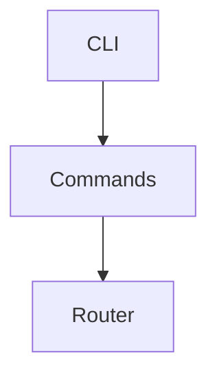

# Commands Module

## Purpose
Provides CLI subcommands such as `setup`, `extensions`, and `toolset`.

## Architecture


## Delegate
Spawned by the Commander program in `src/index.ts` which delegates to these handlers.

## Example
```ts
import { main as extensions } from './extensions/main.js';
await extensions(['install', 'sample']);
```
