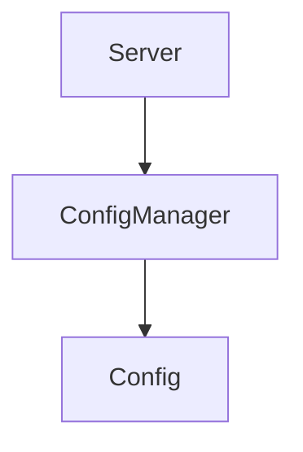

# Config Manager Module

## Purpose
Centralizes reading and writing of HyperTool configuration and manages migrations.

## Architecture


## Delegate
Invoked by CLI utilities like `hypertool-mcp config` to adjust settings.

## Example
```ts
import { ConfigurationManager } from './index.js';
const manager = new ConfigurationManager();
await manager.loadMainConfig();
```
