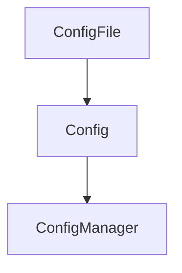

# Config Module

## Purpose
Loads and validates server and extension configuration from files or preferences.

## Architecture


## Delegate
Used by server startup and the configuration manager to discover and parse `mcp.json`.

## Example
```ts
import { discoverMcpConfig } from './mcpConfigLoader.js';
const config = await discoverMcpConfig();
```
