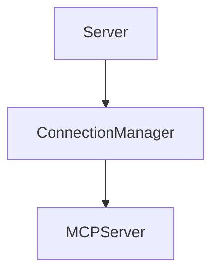

# Connection Module

## Purpose
Maintains client connections and pooling to underlying MCP servers and monitors health.

## Architecture


## Delegate
The server instantiates `ConnectionManager` to spawn and manage connections.

## Example
```ts
import { ConnectionManager } from './manager.js';
const manager = new ConnectionManager();
await manager.addServer(serverConfig);
```
