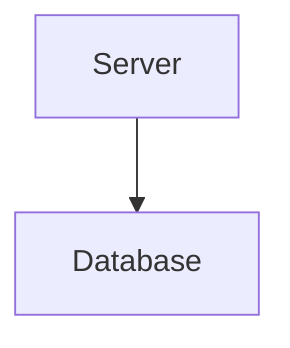

# Database Module

## Purpose
Provides file-backed storage services for server configuration and metadata.

## Architecture


## Delegate
Configuration loaders and managers call the composite database service when persisting data.

## Example
```ts
import { CompositeDatabaseService } from './compositeDatabaseService.js';
const db = new CompositeDatabaseService();
await db.init();
```
