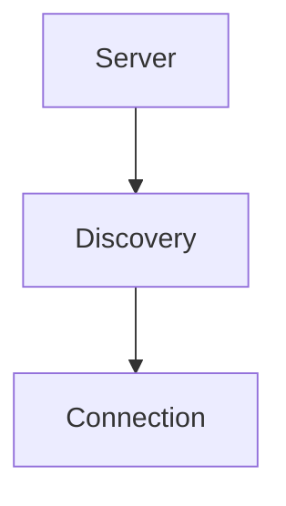

# Discovery Module

## Purpose
Discovers available tools from connected MCP servers and caches metadata.

## Architecture


## Delegate
The request router uses `ToolDiscoveryEngine` to look up tools before routing calls.

## Example
```ts
import { ToolDiscoveryEngine } from './service.js';
const engine = new ToolDiscoveryEngine(manager);
await engine.initialize();
```
