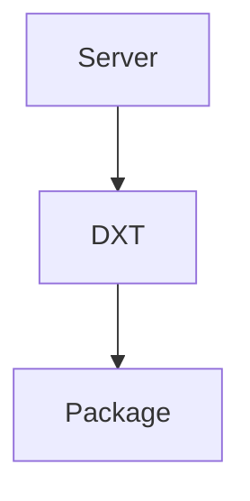

# DXT Module

## Purpose
Loads and extracts DXT packages and reads their manifests.

## Architecture


## Delegate
Feature flag or setup routines call the loader when enabling a DXT package.

## Example
```ts
import { loadDxt } from './loader.js';
const { manifest } = await loadDxt('path/to/package.zip');
```
