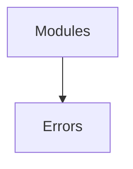

# Errors Module

## Purpose
Defines reusable error classes and recovery helpers for consistent failure handling.

## Architecture


## Delegate
Called throughout the server and router to construct typed errors.

## Example
```ts
import { ConfigurationError } from './index.js';
throw new ConfigurationError('Missing field');
```
