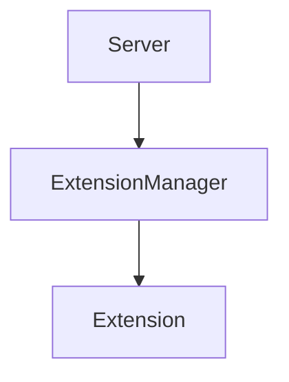

# Extensions Module

## Purpose
Discovers, validates, and manages runtime configuration for extensions.

## Architecture


## Delegate
The extension CLI commands and server startup use `ExtensionManager` to load extensions.

## Example
```ts
import { ExtensionManager } from './manager.js';
const manager = new ExtensionManager();
await manager.initialize();
```
