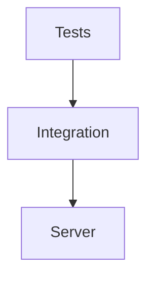

# Integration Tests Module

## Purpose
Contains end-to-end tests verifying HTTP, stdio, and CLI integrations.

## Architecture


## Delegate
Executed by the test runner via `npm test` to ensure components work together.

## Example
```ts
// run a specific integration test
npm test src/integration/stdio-transport.test.ts
```
