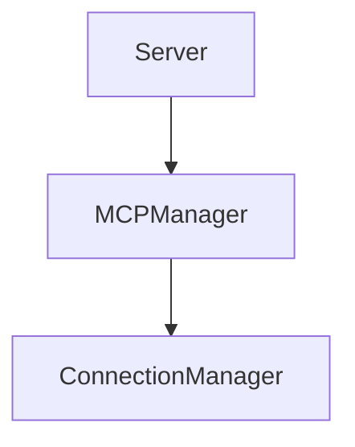

# MCP Manager Module

## Purpose
Reads and updates the user's `mcp.json` to register available MCP servers.

## Architecture


## Delegate
CLI service commands call `MCPServerManager` to add or remove server entries.

## Example
```ts
import { MCPServerManager } from './index.js';
const mgr = new MCPServerManager();
await mgr.initialize();
```
