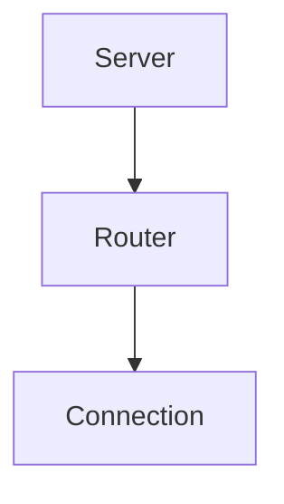

# Router Module

## Purpose
Routes tool invocations to the correct underlying MCP server and tracks stats.

## Architecture


## Delegate
`MetaMCPServer` creates a `RequestRouter` instance that consults discovery and connection managers.

## Example
```ts
import { RequestRouter } from './router.js';
const router = new RequestRouter(discovery, connections);
const result = await router.route(callRequest);
```
