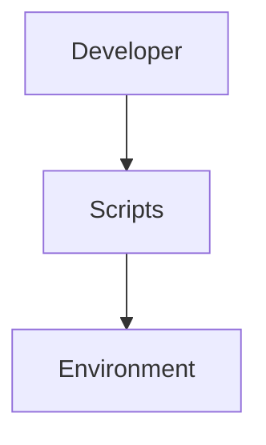

# Scripts Module

## Purpose
Houses setup routines for integrating HyperTool with environments like Cursor or Claude Desktop.

## Architecture


## Delegate
The CLI `setup` command loads these scripts to perform installations.

## Example
```ts
import { CursorSetup } from './cursor/setup.js';
await new CursorSetup().run(false);
```
