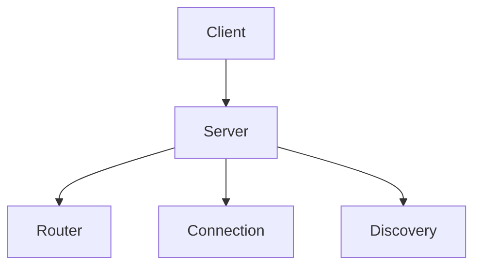

# Server Module

## Purpose
Implements the Meta MCP server classes, HTTP interfaces, and tooling exposure.

## Architecture


## Delegate
`index.ts` bootstraps `MetaMCPServer` or `EnhancedMetaMCPServer` based on runtime options.

## Example
```ts
import { MetaMCPServerFactory } from './factory.js';
const server = await MetaMCPServerFactory.create(config);
await server.start();
```
