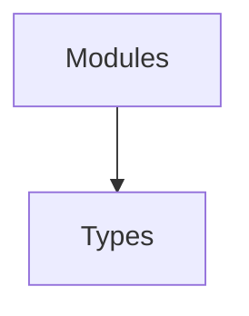

# Types Module

## Purpose
Holds shared TypeScript definitions for runtime and configuration structures.

## Architecture


## Delegate
Imported by most modules to ensure consistent typing.

## Example
```ts
import { RuntimeOptions } from './runtime.js';
function init(opts: RuntimeOptions) {}
```
