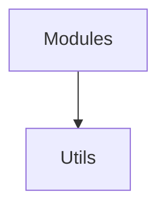

# Utils Module

## Purpose
Provides helper utilities for logging, theming, environment parsing, and path helpers.

## Architecture


## Delegate
Used across the codebase; for example the logger is spawned by `index.ts` during boot.

## Example
```ts
import { createChildLogger } from './logging.js';
const log = createChildLogger({ module: 'demo' });
log.info('started');
```
